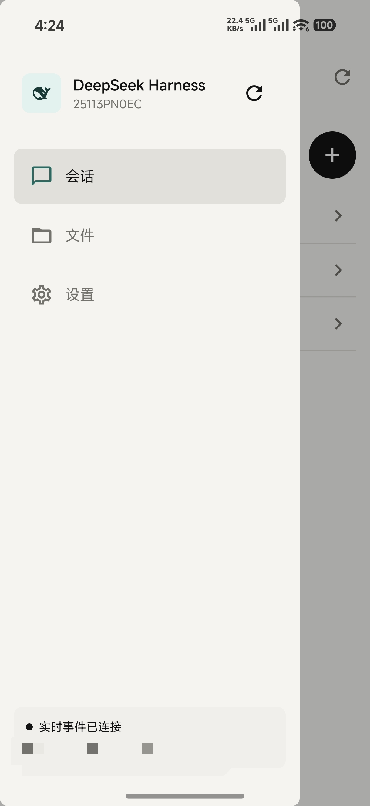
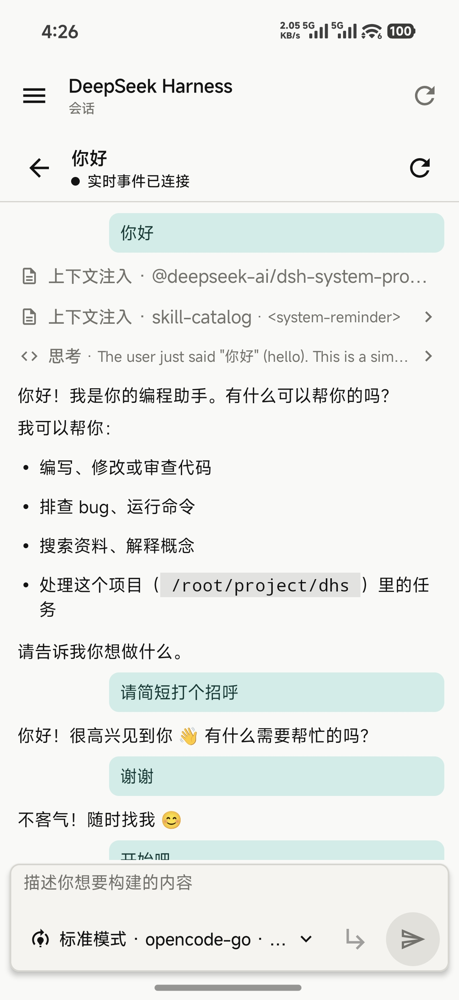
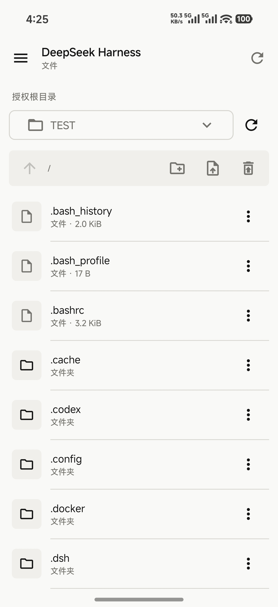
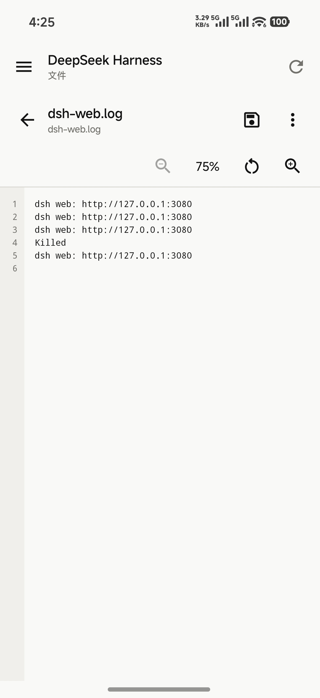
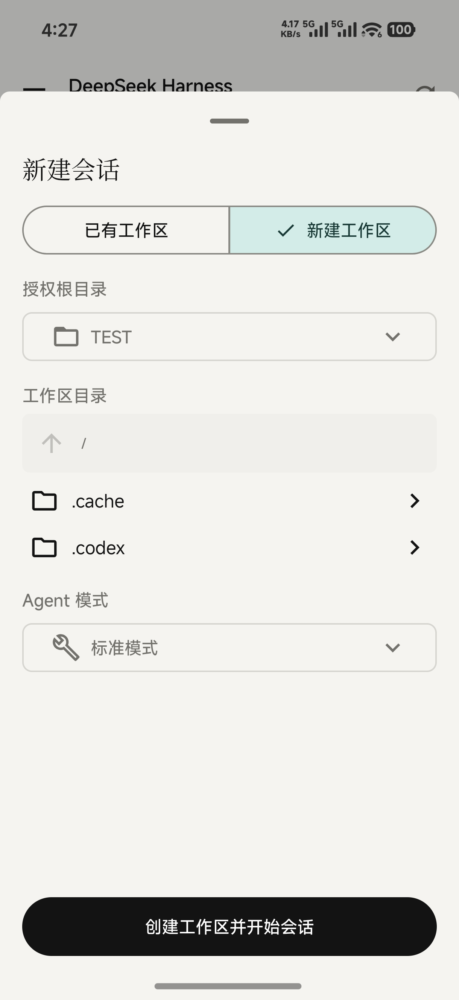
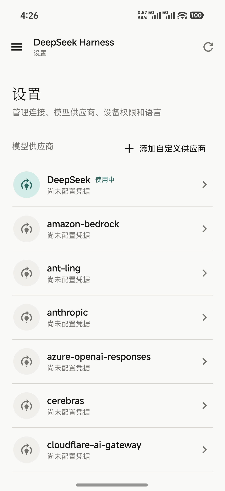

# dsh-android-app

<p align="center">
  <strong>Your own DeepSeek Harness, on Android.</strong>
</p>

<p align="center">
  <a href="./README.md">中文</a> · English
</p>

<p align="center">
  
  
  
  
</p>

`dsh-android-app` is a native Android client for your own DeepSeek Harness installation. It connects through [dsh-workspace](https://github.com/Hakunm/dsh-workspace), keeping your phone and DSH WebUI on the same workspaces, sessions, models, and files.

Continue conversations, follow task progress, decide approvals, switch permissions and models, or edit authorized server files from your phone. The app defaults to Chinese and can switch to English in Settings.

## Screenshots

<p align="center">
  
  
</p>
<p align="center">
  
  
</p>
<p align="center">
  
  
</p>

## Download

Download the latest release from [GitHub Releases](https://github.com/Hakunm/dsh-android-app/releases/latest):

```text
DeepSeek-Harness-v1.0.0.apk
```

Requirements:

- Android 8.0 / API 26 or newer
- A running DeepSeek Harness WebUI installation
- `dsh-workspace` v1.0.0 or a compatible release installed in DSH WebUI
- At least one authorized root and remote access enabled in the plugin
- Network reachability from the phone to the configured IP/domain and port

The production APK uses a dedicated release certificate, not the Android debug key. Future releases must use the same certificate for in-place upgrades.

## Connect to DSH

### On the server

1. Open **Workspace settings** for `dsh-workspace` in DSH WebUI.
2. Add at least one authorized root.
3. Enter the bind IP and port under **Remote access**, then save the listener settings.
4. Select **Enable and create pairing** to receive a ten-minute one-time code.

### On the phone

1. Enter the server address, such as `http://192.168.1.20:3090` or `https://dsh.example.com`.
2. Enter the pairing code and a device name.
3. Select **Pair and connect**.

The device token is stored using Android Keystore-backed encrypted storage. Disconnecting clears the local token. Revoking the device in DSH WebUI invalidates it immediately.

## Chat and task control

- View authorized DSH sessions and live run state.
- Stream assistant text and reasoning, then reconcile with server history on completion.
- Render Markdown headings, lists, quotes, code blocks, and tables.
- Send messages, steer a running task, or cancel it.
- Follow DSH TODO progress and the currently active item.
- Type `/` to browse and run host-provided slash commands.
- Switch between Read only, Workspace write, and Full access permission modes.
- Review redacted approval details and choose Allow once or Deny.
- Select a model and reasoning effort. Empty sessions can also select an Agent before the first message.

## Workspaces and sessions

New sessions may use a workspace already registered in DSH WebUI. You may also pick an existing directory from an authorized root and register it as a new DSH workspace.

Workspace management includes listing, renaming, and removing registrations. Removing a registration does not delete its directory, files, or session logs.

Each session menu provides:

- **Rename** to change its DSH WebUI title.
- **Fork** to create a child session with the existing history, working directory, and model configuration.
- **Archive** to hide it from the default list while preserving its server log.

The app only shows workspaces and sessions whose working directory is inside a root granted to the device. Server absolute paths are not exposed through the public API.

## File management

- Lazy browsing of authorized roots and directories.
- Create folders/files, upload, download, and replace.
- Rename, move, and send entries to plugin trash.
- View and restore trash items without overwriting path conflicts.
- Edit UTF-8 text with synchronized line numbers.
- Switch between Markdown source and rendered preview.
- Zoom source and preview from `75%-250%` using controls or pinch gestures.
- Detect external changes with ETags and refuse silent overwrites.
- Treat binary files as metadata/download/replace only.

The app cannot add server roots or permanently purge plugin trash. Those high-privilege operations remain available only in the server's local DSH WebUI.

## Model providers

With `settings.read`, the app can view effective provider configuration, models, and whether credentials are present. API key values are never returned by the server.

With `settings.write`, it can also:

- edit provider names, Base URLs, protocols, models, and reasoning settings;
- write or clear provider credentials;
- discover models from compatible services;
- create fully custom DSH providers and model routes.

## Permissions

The server controls which features are available:

| Scope | App access |
| --- | --- |
| `chat.read` | Workspaces, sessions, messages, TODOs, commands, and approvals |
| `chat.write` | Manage workspaces/sessions, send, configure, run commands, and decide approvals |
| `files.read` | Browse, preview, download, and view trash |
| `files.write` | Create, edit, upload, move, and rename |
| `files.delete` | Move files or directories to plugin trash |
| `settings.read` | Provider and model configuration |
| `settings.write` | Provider changes, custom providers, and credential writes |

Every device also needs explicit root grants. A server administrator can change scopes, update root grants, or revoke the device at any time.

## HTTP warning

Both `http://` and `https://` are supported. Plain HTTP sends device tokens, chat, and file content in clear text. It is suitable only for a trusted LAN, VPN, or temporary test.

Use HTTPS through Caddy/Nginx, Tailscale/WireGuard, another VPN, or a trusted tunnel on public or untrusted networks. Do not share pairing codes, device tokens, or APK signing material.

## Privacy

- No advertising or third-party analytics SDKs.
- Device tokens use Android Keystore-backed encrypted storage.
- Provider secrets are written to the DSH credential store and never read back into the app.
- Chat and file data is sent only to the DSH address configured by the user.

## Troubleshooting

**No workspace is available when creating a session**

Switch to **New workspace** and select a directory from an authorized root, or register a workspace in DSH WebUI first.

**Some actions are disabled**

The device lacks the required scope. Update it from the plugin's **Devices** page.

**The app cannot connect**

Confirm remote access is enabled, the firewall/security group allows the port, and the address is reachable from the phone. Do not enter the server's own `127.0.0.1` address.

**A session appears stuck**

Check the conversation for an approval panel. Operations that require permission are not approved in the background.

**A save reports a conflict**

Another process changed the server file. Reload, merge the desired content, and save again.

## Build from source

Use JDK 17 and Android SDK 36:

```sh
./gradlew testDebugUnitTest lintDebug assembleRelease
```

Release builds require a private signing configuration:

```properties
storeFile=/absolute/path/to/release-signing.p12
storePassword=...
keyAlias=...
keyPassword=...
```

Pass it with `-PdshSigningProperties=/path/to/signing.properties`. Never commit signing files or passwords.

## Project

- Version: `v1.0.0`
- Package: `io.github.hakunm.deepseekharness`
- Author: [Github@Hakunm](https://github.com/Hakunm)
- License: [GNU Affero General Public License v3.0](./LICENSE)
- Server plugin: [dsh-workspace](https://github.com/Hakunm/dsh-workspace)
